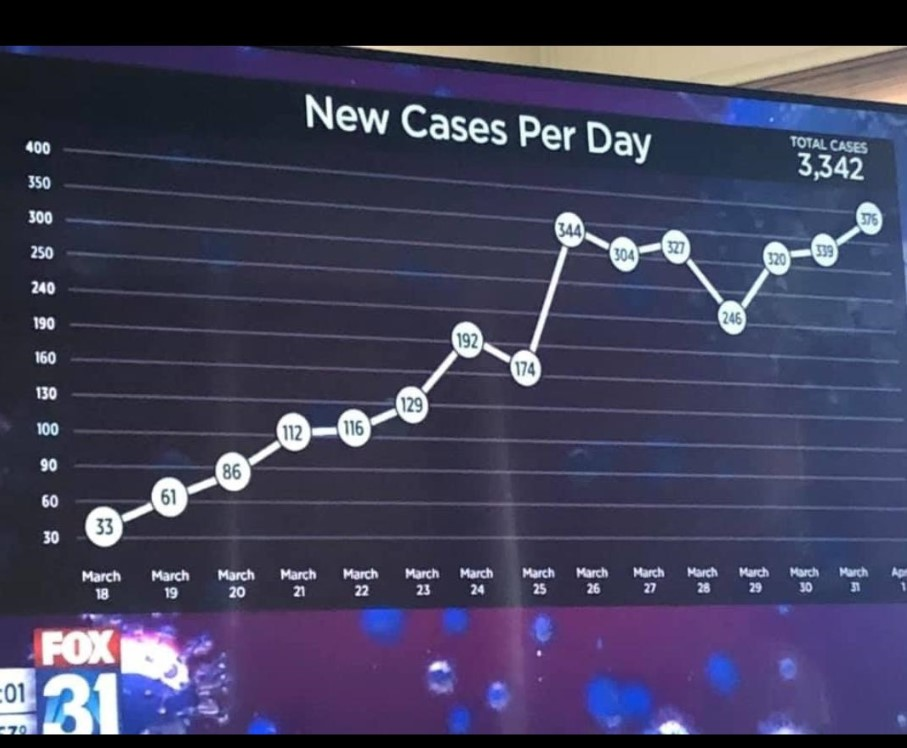
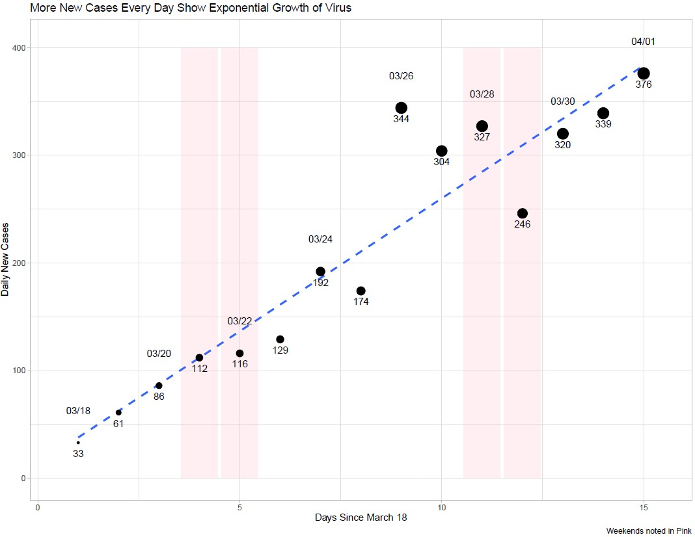

# fox31_covid
A quick tutorial on improving the Fox31 Covid Visualization I posted on LinkedIn

# Original image: 

Issues on this one include: 

1) A bad y axis. 

Visuals should start at 0 unless you have a good reason not too (e.g. GDP or stock graphs where the difference or change is what is important not the value itself). 

Also, the axes breaks should be consistent. For a graph like this you can use 0->400 broken into a clean 25 or 50 per break. 

2) inappropriate points. 

The graph encircles the true value in a bubble that is consistent in size, for 3-digit values, the font size gets smaller. 
Manipulating font sizes can be misleading. 

Instead, consider sizing by new cases and using annotations directly in the empty space of the chart to label extreme values (here, extreme would be the small values). 

3) Not noting weekends appropriately. 

Work with a domain expert to verify that new cases are actually being published daily. The context for COVID-19 is that Mondays typically include cases found since Friday, so weekends might be misrepresented (Mar 28-29 drop). 

# My rough draft recommended update 

 

Here's a first pass at how I would recommend showing this data to a *technical* audience. I would actually make this an SVG and use a formal software like Adobe Illustrator for a TV-ready version, but it meets the following best practices: 

1) All data could hypothetically be extracted from the visualization (all dates and values are available). 

2) domain-specific anomalies are noted - here I made weekends have pink backgrounds (in economic graphs recessions are typically backgrounded in grey or red) because depending on the locality, Monday may get a disproportionate amount of Saturday & Sunday reported cases. 

3) The axes are consistent in their reference. I use 0 for Y axis and instead of March 18-April 1 (which has no reference) I used Days Since March 18th. The context there is that March 18th was the first day that all 50 states had at least 1 reported case. 

4) The point of this graph is simple, if daily new cases grows linearly, then total cases will grow exponentially. So I made the point the graph title and sized by new cases daily. I removed the legend because it would only be appropriate if I had used a discrete set of circles, but the size here is equivalent to the height so I didn't want to waste the space. 
